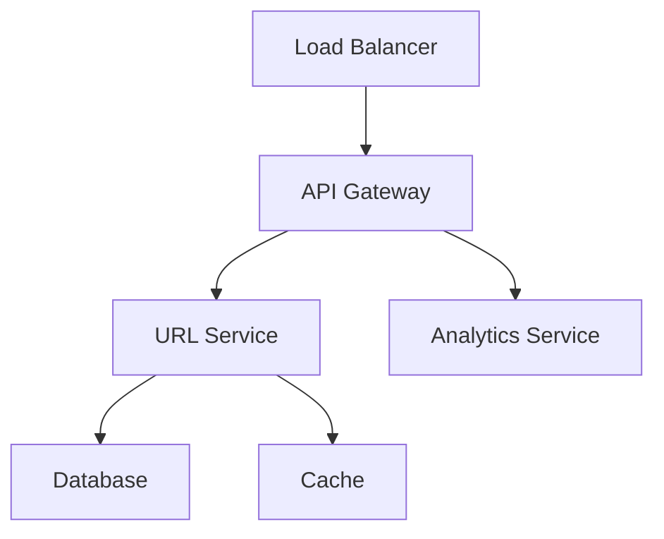

# Markdown Support in Test Questions

The test platform now supports **Markdown formatting** in question text (`promptText`), allowing you to create rich, well-formatted questions with code syntax highlighting, tables, lists, and more.

## 🎯 Features Supported

- ✅ **Headers** (H1, H2, H3, etc.)
- ✅ **Code blocks** with syntax highlighting
- ✅ **Inline code** formatting
- ✅ **Tables** for structured data
- ✅ **Lists** (ordered and unordered)
- ✅ **Bold** and *italic* text
- ✅ **Links** (opens in new tab)
- ✅ **Blockquotes** for hints/notes
- ✅ **GitHub Flavored Markdown** (GFM) support

## 📝 How to Use

Simply write your question text using standard Markdown syntax in the `promptText` field when creating questions.

### Example Question Creation

```javascript
const question = await prisma.question.create({
  data: {
    promptText: `# JavaScript Array Methods

Which method correctly filters an array?

\`\`\`javascript
const numbers = [1, 2, 3, 4, 5];
// Your code here
\`\`\`

**Requirements:**
- Use modern ES6+ syntax
- Return only even numbers`,
    category: 'LOGICAL',
    timerSeconds: 60,
    answerOptions: [
      'numbers.filter(n => n % 2 === 0)',
      'numbers.map(n => n % 2 === 0)',
      'numbers.find(n => n % 2 === 0)',
      'numbers.reduce((acc, n) => n % 2 === 0)'
    ],
    correctAnswerIndex: 0,
    testId: 'your-test-id'
  }
});
```

## 🎨 Formatting Examples

### 1. Headers and Structure

```markdown
# Main Topic
## Subtopic
### Specific Question

This creates a clear hierarchy in your questions.
```

### 2. Code Blocks with Syntax Highlighting

````markdown
```javascript
function fibonacci(n) {
  if (n <= 1) return n;
  return fibonacci(n - 1) + fibonacci(n - 2);
}
```

```python
def quicksort(arr):
    if len(arr) <= 1:
        return arr
    pivot = arr[len(arr) // 2]
    return quicksort([x for x in arr if x < pivot]) + \
           [x for x in arr if x == pivot] + \
           quicksort([x for x in arr if x > pivot])
```

```sql
SELECT department, AVG(salary) as avg_salary
FROM employees 
WHERE hire_date > '2020-01-01'
GROUP BY department
ORDER BY avg_salary DESC;
```
````

### 3. Inline Code

```markdown
Use the `Array.prototype.filter()` method to solve this problem.
The variable `userName` should be validated before processing.
```

### 4. Tables for Data

```markdown
| Function | Time Complexity | Space Complexity |
|----------|----------------|------------------|
| Binary Search | O(log n) | O(1) |
| Quick Sort | O(n log n) | O(log n) |
| Hash Table Lookup | O(1) | O(n) |
```

### 5. Lists for Requirements

```markdown
**Requirements:**
- Function must be pure (no side effects)
- Handle edge cases (empty arrays, null values)
- Use ES6+ arrow functions
- Return type should be consistent

**Given constraints:**
1. Array length: 1 ≤ n ≤ 10^5
2. Element values: -10^9 ≤ arr[i] ≤ 10^9
3. Time limit: 2 seconds
4. Memory limit: 256 MB
```

### 6. Emphasis and Formatting

```markdown
This is **very important** information.
This is *emphasized* text.
This is ***both bold and italic***.

> **Hint:** Consider using a hash map for O(1) lookups.
> 
> **Note:** The algorithm should handle duplicate values correctly.
```

### 7. Links and References

```markdown
Refer to the [MDN Documentation](https://developer.mozilla.org/en-US/docs/Web/JavaScript/Reference/Global_Objects/Array/filter) for more details.

See the [Python PEP 8 Style Guide](https://pep8.org/) for coding standards.
```

## 🚀 Complete Example Questions

### Example 1: Algorithm Analysis

```markdown
# Algorithm Complexity Analysis

Analyze the following sorting algorithm:

\`\`\`python
def mystery_sort(arr):
    n = len(arr)
    for i in range(n):
        for j in range(0, n - i - 1):
            if arr[j] > arr[j + 1]:
                arr[j], arr[j + 1] = arr[j + 1], arr[j]
    return arr
\`\`\`

**Analysis Questions:**
1. What sorting algorithm is this?
2. What is the time complexity?
3. Is it stable?

**Given:** Array of integers with length n where 1 ≤ n ≤ 1000

What is the **worst-case time complexity** of this algorithm?
```

### Example 2: Database Design

```markdown
## Database Schema Design

You're designing a database for an e-commerce platform:

**Tables:**
| Table | Primary Key | Description |
|-------|-------------|-------------|
| users | user_id | Customer information |
| products | product_id | Product catalog |
| orders | order_id | Customer orders |
| order_items | (order_id, product_id) | Items in each order |

**Relationships:**
- One user can have many orders
- One order can have many products
- One product can be in many orders

Which SQL query finds the **top 5 customers** by total order value?
```

### Example 3: System Design

```markdown
# Microservices Architecture

Design a **URL shortening service** (like bit.ly):

## Requirements:
- **Scale:** 100M URLs shortened per day
- **Read/Write Ratio:** 100:1 (more reads than writes)
- **URL Length:** 7 characters
- **Availability:** 99.9% uptime

## Components:


**Question:** Which database strategy is most suitable for storing URL mappings?

> **Hint:** Consider read/write patterns and horizontal scaling requirements.
```

## 🛠️ Implementation Details

The markdown rendering is handled by:
- **react-markdown**: Core markdown parsing
- **remark-gfm**: GitHub Flavored Markdown support
- **rehype-highlight**: Syntax highlighting for code blocks
- **highlight.js**: Syntax highlighting themes

### Supported Languages for Code Blocks

- JavaScript/TypeScript
- Python
- Java
- C/C++
- SQL
- HTML/CSS
- JSON
- Bash/Shell
- And many more...

## 📋 Best Practices

### 1. Question Structure
```markdown
# Clear Topic Header
Brief context or setup

## Code/Data Section
\`\`\`language
// Your code here
\`\`\`

## Requirements/Constraints
- Bullet point requirements
- Clear expectations

**Question:** What is the specific thing you're asking?
```

### 2. Code Formatting
- Always specify the language for syntax highlighting
- Keep code blocks concise and relevant
- Use proper indentation
- Add comments where helpful

### 3. Visual Hierarchy
- Use headers to organize content
- Use **bold** for important terms
- Use *italics* for emphasis
- Use `inline code` for technical terms

### 4. Tables for Data
- Use tables for structured information
- Keep tables readable and not too wide
- Include headers for clarity

## 🎯 Demo Test

A demo test has been created with ID: `65270b1a-8ec9-4de0-8898-7e005019065c`

This test includes examples of:
- Code syntax highlighting
- Tables and structured data
- Headers and formatting
- Lists and bullet points
- Bold and italic text

## 🔧 Creating Tests with Markdown

You can create tests with markdown questions using:

1. **Admin Interface**: Use the web interface to create questions
2. **Scripts**: Use Node.js scripts like the demo script
3. **API**: Use the REST API endpoints

### Script Example

```javascript
// See scripts/create-markdown-demo-test.js for a complete example
const question = {
  promptText: `# Your Markdown Content Here
  
\`\`\`javascript
console.log('Hello, World!');
\`\`\`

**What does this code output?**`,
  category: 'LOGICAL',
  timerSeconds: 60,
  answerOptions: ['Hello, World!', 'undefined', 'Error', 'null'],
  correctAnswerIndex: 0,
  testId: testId
};
```

## 🎉 Benefits

- **Better Readability**: Clean, formatted questions
- **Code Clarity**: Syntax-highlighted code blocks
- **Professional Look**: Modern, clean presentation
- **Flexibility**: Support for complex question formats
- **Consistency**: Standardized formatting across all questions

---

**Happy question writing!** 🚀 